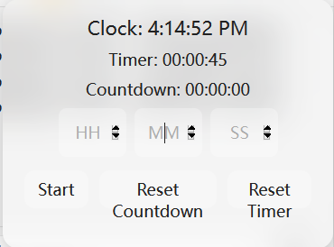

# Zotero Clock and Timer

# ⏳ Zotero Clock & Timer Plugin ⏳  

**Zotero Clock & Timer Plugin** – a powerful, elegant, and simple tool to help you **stay productive** and **manage your research time effectively**.  

## ✨ Features  
1.  **Clock💡** – Always keep an eye on the current time.  
2.  **Timer⏱** – Track how long you've been reading and researching.  
3.  **Countdown Timer⏳** – Set a countdown to stay focused and efficient.  

🎯 **Perfect for:**  
✔️ Tracking paper reading sessions  
✔️ Managing research sprints  
✔️ Enhancing productivity with time awareness  

---

## 🎨 Stunning UI  
🌟 **Glassmorphism Design** – A modern, semi-transparent look.  
🖱 **Draggable Interface** – Move it anywhere for convenience.  
🎯 **Minimalist & Non-Intrusive** – Designed to blend smoothly into Zotero.  

---

## 🚀 Get Started  
Simply **install & activate** the `.xpi` file plugin in Zotero, and start tracking your time instantly!  

⏰ **Stay on top of your research – one second at a time!**  

---

## How to contribute (for Developers):
1. run `git clone https://github.com/xcjames/zotero_timer`, clone to your local machine (or use Github codespace). Add the function that you want to develop in the js files.
2. run `./make-zips`, then you will see a "./build" directory, there is your `zotero-timer.xpi` file that can be installed

